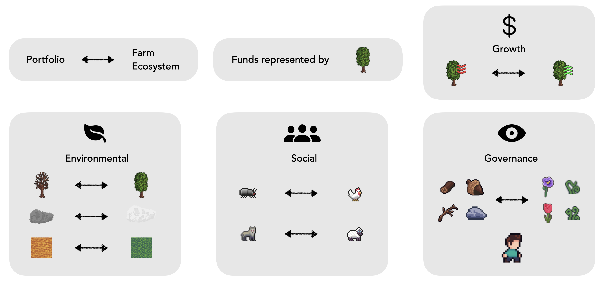
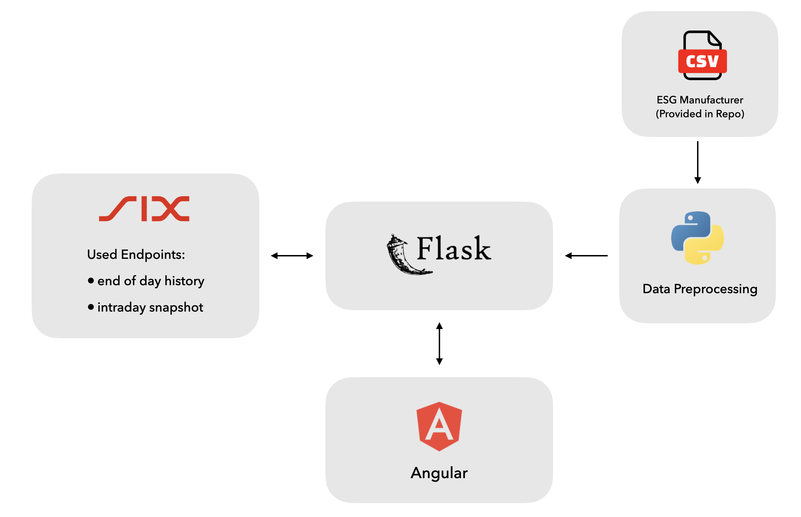

This was a challenge proposed by SIX Financial Informations at the [START Hack 2024](https://www.startglobal.org/start-hack/home) in St.Gallen.

## What is ESG?

## Description

As the wordplay might suggest, it is a gamified pixel-art eco-system visualisation of your ESG score for your portfolio. This allows investors to quickly grasp the system's health through distinctive icons and tilesets that represent the four key areas: Growth, Environmental, Social, and Governance factors of the portfolio. 

At the core, each fund is represented by a tree. The growth of an asset is visualised through arrows pointing up or downwards, for increasing or decreasing values respectively.

For the **environmental factor** we chose a dead tree, polluted clouds and a desert tile on the floormesh to represent a bad environmental score while on the opposite side of the spectrum we have a healthy green tree, normal white clouds and a grassy tile.

For the **social factor** we chose the use of wild, uncultivated or undesired animals or insects such as the bug or wolf to represent a bad score and typical domesticated animals, such as the chicken and sheep, for a good score.

Lastly for **governance** we decided on describing it by the amount and type of debris/ground clutter found, such as random branches, rocks and twigs for a bad score and cultivated and well-treated bushes and plants for good scores. At the same time we have a park ranger that is meant to look after and protect the ecosystem.

## Tech Stack

Below is an overview of the used Tech stack. The backend consists of data preprocessing in python of a ESG manufacuters list in a `.csv` provided by the challenge, that lists out the different scores for each of the companies. This preprocessing is combined in a Flask server that also communicates with the SIX API to retrieve relevant information about the asset such as current price and growth numbers.

