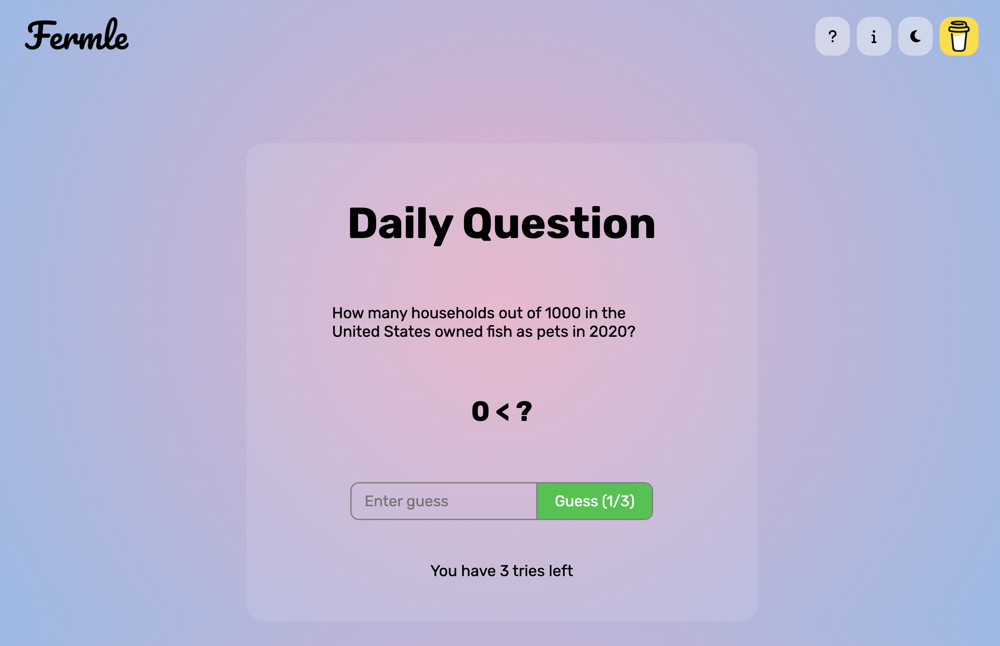

 
<!-- [Regression](https://en.wikipedia.org/wiki/Regression_analysis): -->

A small daily game, ([Fermle](https://fermle.xyz)), created over a weekend and inspired by popular sites like Wordle and Travle. Each day, a new Fermi question is presented, and players have three attempts to guess the correct answer. The score is based on the number of tries and the accuracy of the guesses.

The goal of this project was to learn the basics of website deployment. The game is built using HTML, CSS, and JavaScript.